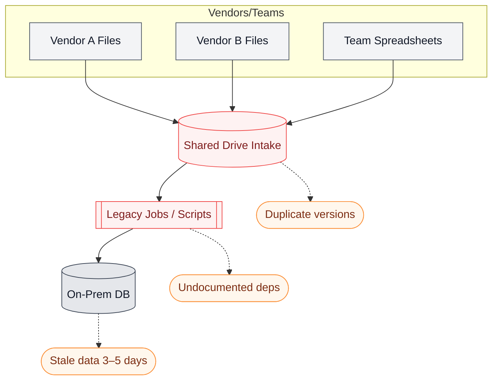
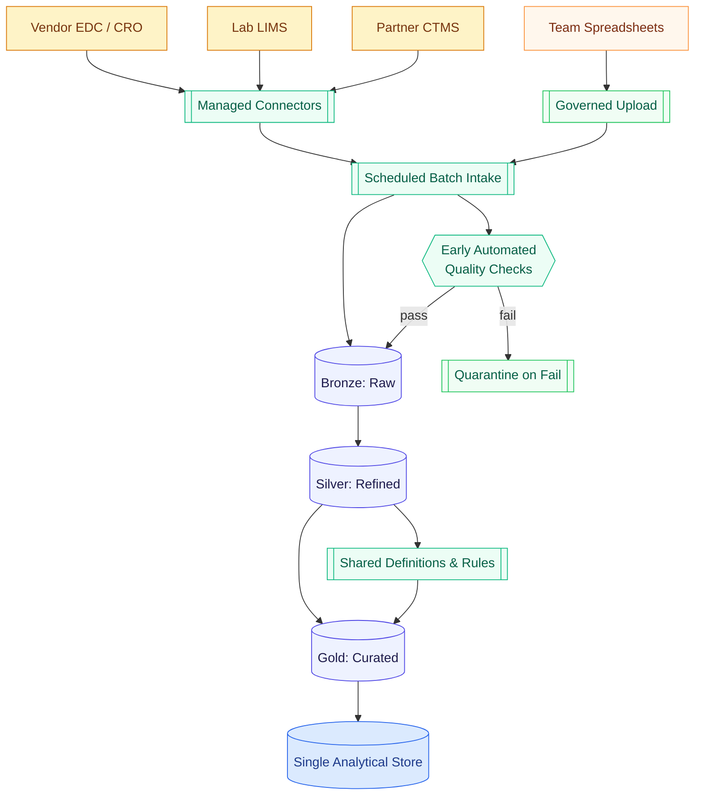

  See exactly how your data moves — and where it’s getting stuck — before you make your next move.

---

## Why teams call me
In many organizations, data is scattered across systems, teams, and vendors. People spend more time moving data than using it.

**Common signs:**
- **Conflicting reports or metrics**
- **Slow handoffs and rework** between teams/vendors
- **Manual reconciliations** and spreadsheet glue
- **Unclear ownership** and “hidden” upstream dependencies

This happens in:
- Complex, regulated environments (like healthcare, life sciences, manufacturing, finance)
- Distributed teams with multiple vendors or complex reporting requirements
- Fast-moving orgs adding tools without a central plan

Leaders know there’s a problem — but not:
- What data they actually have  
- Where it’s coming from  
- How it flows (or fails to flow) between people and systems  
- Which fixes will matter most  

Without clarity, teams waste time, duplicate work, and make decisions on unreliable information.

---

## What you get
A short, focused **advisory engagement (2–3 weeks)** designed to give you clarity fast.  

You’ll walk away with:

1. **Current-State Data Map** — A clear, visual diagram of your systems, data sources, and handoffs.

*Example (fictional & anonymized)*:

2. **Issues & Risks Report** — Where delays, duplication, and errors occur, and why they happen.  
3. **Prioritized “Top 5”** — The changes that will have the biggest immediate impact.  
4. **Future-State Blueprint** — A high-level target flow for cleaner, more reliable data operations.

*Example (fictional & anonymized)*:

---

## Engagement at a glance

---

## Who it’s for
Best fit for teams that:
- **Feel overwhelmed** by the complexity or volume of their data  
- **Aren’t sure** how data really moves between people, systems, and vendors  
- **Want clarity first** — before investing in new tools or hiring more staff  
- Need a **fast, low-risk way** to identify their biggest opportunities

Especially valuable for:
- Healthcare, life sciences, and other highly regulated environments  
- Organizations with distributed teams, multiple vendors, or complex reporting requirements  

---

## Who it’s not for
Not a fit if you’re only:
- Looking for a single tool/software recommendation  
- Expecting hands-on implementation during this short engagement  

*(If implementation is needed, we can scope it separately.)*

---

## How it helps
- **Faster, more confident decisions** — Fix upstream disconnects so reports align the first time  
- **Less waste** — Eliminate redundant processes and manual reconciliations  
- **Stronger foundations** — Make smarter choices about systems, vendors, and staffing  
- **Clear priorities** — Focus on changes that deliver the biggest impact quickly  

---

## Why it works
- **Independent view** — No vendor bias or software upsell  
- **Approachable & visual** — Clear diagrams and explanations anyone can follow  
- **Actionable** — You leave with a prioritized plan you can start using right away, not a vague wishlist  

---

## About me
I’m **Melanie Logan** — a Data Platform Engineer (and former Statistical Programmer) who has spent years mapping and improving data flows in complex environments. I bridge the gap between day-to-day operations and long-term strategy, helping teams cut through complexity and create data systems that actually work for them.

---

## Next step
- 📧 Email: **[hello@nexaform.io](mailto:hello@nexaform.io)**  
- 📅 Book a free 30-minute consultation  
- 📄 Receive a fixed-fee proposal with clear scope and deliverables  

---

> *All services are offered independently, using my own time, tools, and resources, and are not performed on behalf of or in affiliation with my current employer. No proprietary information, methods, or logic from my current or former employers is used. I do not engage with my current employer’s customers, potential customers, or competitors as part of these services.*
