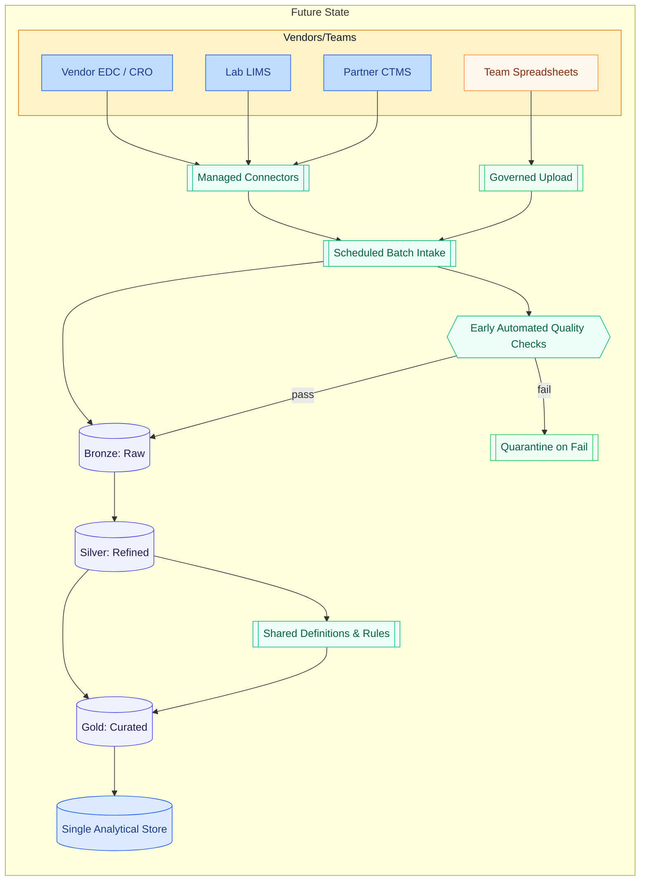

  See exactly how your data moves — and where it’s getting stuck — before you make your next move.

  **Note:** This is a pilot version of Data Clarity Audit, designed to be a focused, high-impact engagement. I’m currently offering it to a small number of organizations as I refine the process. If you’re interested in being part of the pilot or discussing future availability, feel free to get in touch.

---

## Why Teams Call Me
In many organizations, data is scattered across systems, teams, and vendors. You might feel like you spend more time moving data around than actually using it.

**Common signs:**
- **Conflicting reports or metrics** — the same question gets different answers depending on who you ask  
- **Slow handoffs and rework** between teams/vendors  
- **Manual reconciliations** and “spreadsheet glue” holding critical processes together  
- **Unclear ownership** and “hidden” upstream dependencies that break things unexpectedly  

**Most often, I see this in:**
- Healthcare, life sciences, and other regulated industries where processes are high-stakes but fragmented  
- Distributed teams with multiple vendors or complex reporting requirements  
- Fast-moving organizations where every team adds tools without a central plan

**Leaders know there’s a problem — but not**:
- What data they actually have  
- Where it’s coming from  
- How it flows (or fails to flow) between people and systems  
- Which fixes will matter most  

Without this clarity, teams waste time, duplicate work, and make decisions on unreliable information.  
That’s where I come in — giving you a clear picture of your data and where to focus first.

---

## What You Get
A short, focused **advisory engagement (2–3 weeks)** designed to give you clarity fast.  

By the end, you’ll have a **complete picture of your current data reality** and a **clear path to the biggest improvements**.

**1 - Current-State Data Map** — A clear, visual diagram of your systems, data sources, and handoffs so everyone sees the same picture.  
   *Example (fictional & anonymized)*:

```mermaid
flowchart TD
  classDef bg fill:#f9fafb,stroke:#f9fafb,stroke-width:0px
  classDef bad fill:#fef2f2,stroke:#ef4444,color:#7f1d1d
  classDef neutral fill:#f3f4f6,stroke:#4b5563,color:#111827
  classDef store fill:#e5e7eb,stroke:#374151,color:#111827
  classDef pain fill:#fff7ed,stroke:#fb923c,color:#7c2d12

  subgraph Current State
    class Canvas bg
    direction TB

    subgraph Vendors[ Vendors/Teams ]
      V1[Vendor A Files]:::neutral
      V2[Vendor B Files]:::neutral
      T1[Team Spreadsheets]:::neutral
    end
    style Vendors fill:#fef3c7,stroke:#d97706,stroke-width:1px,color:#111827

    SD[(Shared Drive Intake)]:::bad
    LJ[[Legacy Jobs / Scripts]]:::bad
    OP[(On-Prem DB)]:::store

    V1 --> SD
    V2 --> SD
    T1 --> SD
    SD --> LJ
    LJ --> OP

    P1([Duplicate versions]):::pain
    P2([Undocumented dependencies]):::pain
    P3([Stale data 3–5 days]):::pain

    SD -.-> P1
    LJ -.-> P2
    OP -.-> P3
  end
```

**2 - Issues & Risks Report** — Identifies where delays, duplication, and errors occur, explains why they happen, and highlights the cost of leaving them unresolved.

**3 - Prioritized “Top 5”** — A short list of the changes that will deliver the fastest and biggest impact, so you know exactly where to start.

**4 - Future-State Blueprint** — A high-level target flow for cleaner, more reliable data operations.

*Example (Fictional & Anonymized)*:

---

## Engagement at A Glance

| Item | Details |
|---|---|
| Duration | 2–3 weeks |
| Format | 3–4 working sessions + remote analysis |
| Deliverables | PDF report, visual data map, prioritized improvement plan |
| Commitment | Fixed-scope, fixed-fee advisory (no implementation required) |

---

## Who It’s For
Best fit for teams that:
- **Feel overwhelmed** by the complexity or volume of their data  
- **Aren’t sure** how data really moves between people, systems, and vendors  
- **Want clarity first** — before investing in new tools or hiring more staff  
- Need a **fast, low-risk way** to identify their biggest opportunities

Especially valuable for:
- Healthcare, life sciences, and other highly regulated environments  
- Organizations with distributed teams, multiple vendors, or complex reporting requirements  

---

## Who It’s Not For
Not a fit if you’re only:
- Looking for a single tool/software recommendation  
- Expecting hands-on implementation during this short engagement  

*(If implementation is needed, we can scope it separately.)*

---

## How It Helps
- **Faster, more confident decisions** — Fix upstream disconnects so reports align the first time  
- **Less waste** — Eliminate redundant processes and manual reconciliations  
- **Stronger foundations** — Make smarter choices about systems, vendors, and staffing  
- **Clear priorities** — Focus on changes that deliver the biggest impact quickly  

---

## Why It Works
- **Independent view** — No vendor bias or software upsell  
- **Approachable & visual** — Clear diagrams and explanations anyone can follow  
- **Actionable** — You leave with a prioritized plan you can start using right away, not a vague wishlist  

---

## About Me
I’m **Melanie Logan** — a Data Platform Engineer (and former Statistical Programmer) who has spent years mapping and improving data flows in complex environments. I bridge the gap between day-to-day operations and long-term strategy, helping teams cut through complexity and create data systems that actually work for them.

---

## Next Step
- 📧 Email: **[hello@nexaform.io](mailto:hello@nexaform.io)**  
- 📅 Book a free 30-minute consultation  
- 📄 Receive a fixed-fee proposal with clear scope and deliverables  

---

> *All services are offered independently, using my own time, tools, and resources, and are not performed on behalf of or in affiliation with my current employer. No proprietary information, methods, or logic from my current or former employers is used. I do not engage with my current employer’s customers, potential customers, or competitors as part of these services.*
