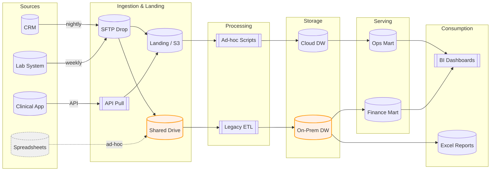
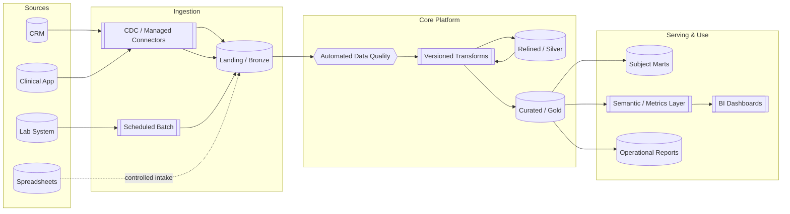
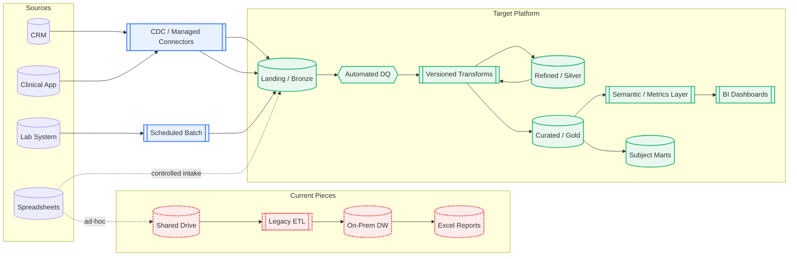

This example shows how a **Data Clarity Audit** reveals the current data landscape, identifies pain points, and proposes a streamlined, scalable architecture.  

It’s based on a realistic (but fictional) organization — enough complexity to match the real world, but simplified for clarity.

---

# Current-State Architecture

Below is a *“Goldilocks”* current-state diagram: realistic but readable.  
It shows multiple ingestion methods, manual steps, two warehouses, and shadow reporting paths.

## Key Observations
- Two warehouses (on-prem and cloud) create conflicting “sources of truth.”
- Manual spreadsheet flows bypass governance.
- Legacy ETL and ad-hoc scripts exist in parallel.
- Shadow reporting in Excel increases reconciliation effort.

---

# Future-State Architecture

Here’s the proposed future-state: one ingestion front door, one platform, automated quality checks, and a governed semantic layer.

## Key Improvements
- **One platform** with Bronze → Silver → Gold layers.
- **Automated data quality checks** at the Bronze stage.
- **Versioned transformations** for reproducibility.
- **Controlled spreadsheet intake** (no uncontrolled bypass).
- **Semantic layer** ensures consistent metrics across BI and reports.

---

# Delta Map — What Changed
This “delta” diagram highlights the differences:

- **Red (dashed)** = to retire
- **Green** = to add
- **Blue** = migrate or standardize

## Legend
- **Red (dashed)**: Retire/remove from architecture
- **Green**: Add in the target design
- **Blue**: Migration or standardization step

---

# Before/After Comparison

| Area       | Before                      | After                                    |
| ---------- | --------------------------- | ---------------------------------------- |
| Ingestion  | SFTP + ad-hoc scripts + NAS | CDC/managed connectors into Bronze       |
| Processing | Legacy ETL, unversioned SQL | Versioned transforms (dbt) + tests       |
| Storage    | On-Prem DW + Cloud DW       | Single platform (Bronze → Silver → Gold) |
| Access     | Excel & team marts          | Governed marts + semantic layer          |
| Quality    | Spot checks                 | Automated DQ + monitoring                |

---

# Why This Matters
By moving from a fragmented, manual-heavy architecture to a unified and governed one:

- **Decisions are faster** — less time spent reconciling numbers.
- **Quality improves** — issues are caught earlier in the pipeline.
- **Scalability increases** — the architecture can handle more sources and consumers without breaking.
- **Teams trust the data** — one version of the truth reduces conflict and rework.

> *This example is fictional but reflects real patterns we see in many organizations. In a Data Clarity Audit, your diagrams and recommendations would be tailored to your exact systems, processes, and goals.*