    Many organizations focus on fixing individual data issues but overlook the bigger picture: how data enters, moves, and is governed across the entire environment. This article shows a before-and-after example of moving from fragmented data flows to a governed pipeline without relying on tool-first thinking.

   📄 This article is part of the <a href="/tags/#modern-data-platform-foundations">Modern Data Platform Foundations</a>  series covering the two key layers of modernization: data engineering and platform engineering.

Image created by the author

In my previous article, [Data Platform Engineering for Regulated Teams](/data%20&%20platform%20engineering/data-platform-engineering-for-regulated-data-teams/), I explained why modernizing data in regulated industries requires more than swapping out tools.  

This follow-up shows what it looks like to move from a fragmented data flow to a governed data pipeline.

If you’re unsure what a “data pipeline” is, see my definition here: [What is Data Engineering?](https://mlogan914.github.io/data%20&%20platform%20engineering/what-is-data-platform-engineering/#data-engineering)  

> **Note:** If you are unfamiliar with any terms or acronyms in this article or its diagrams, refer to the [summary of acronyms](#summary-of-acronyms) at the end of the article.  

---

## Two Layers of Modernization

Modernizing data involves two connected layers:  

1. **Data Engineering** – Designing and building standardized, governed pipelines that handle ingestion, transformation, and controlled outputs.  
2. **Platform Engineering** – The delivery model for those pipelines: modular workflows, reusable components, automation, and tooling that reduce the burden on engineers.  

> This article focuses on the **first layer** — data engineering — and illustrates what modernized pipelines can look like. The *how* of building and running them (platform engineering) is equally important and will be covered in a future article.

### Data Engineering – The What

### Platform Engineering – The How

---

## The Core Idea

Many organizations have data flowing in from multiple systems and vendors, each using diffrent transfer methods. Without consistent entry points or structure, the result is hard to scale, hard to trust, and expensive to maintain.

A modern engineering approach changes that by:
- Defining **one “front door”** for all incoming data.
- Running **quality checks early**.
- Using **layered storage** to clearly separate raw, refined, and curated data.
- Governing **how definitions and rules are applied** so they’re consistent everywhere.

---

## Example: Current vs. Future State

Here’s a fictional example to make it clear.

---

### Current State: Fragmented and Inconsistent

```mermaid
flowchart LR
  %% Sources
  subgraph SRC[Sources]
    CRM[(CRM System)]
    EHR[(Clinical App)]
    LIMS[(Lab System)]
    Sheets[(Spreadsheets – uncontrolled)]
  end

  %% Ingestion & Landing
  subgraph ING[Ingestion & Landing]
    SFTP[(SFTP Drop)]
    API[[API Pull]]
    NAS[(Shared Drive – uncontrolled)]:::problem
    Intake[(Cloud Landing Area)]
  end

  %% Processing
  subgraph PROC[Processing]
    Legacy[[Legacy Jobs]]:::problem
    Scripts[[Ad-hoc Scripts]]:::problem
  end

  %% Storage
  subgraph STORE[Storage]
    OnDW[(On-Prem DW)]:::problem
    Cloud[(Cloud DW)]
  end

  %% Flows
  CRM --> SFTP --> Intake
  EHR --> API --> Intake
  LIMS --> SFTP --> NAS
  Sheets -. ad-hoc .-> NAS

  Intake --> Scripts --> Cloud
  NAS --> Legacy --> OnDW

  %% Styling
  classDef problem stroke-dasharray:5 3,stroke:#e5484d,stroke-width:2px;
```

**Key Characteristics**:
- Multiple uncontrolled entry points (SFTP, shared drives, ad-hoc files).
- Different storage environments holding overlapping data.
- Custom logic scattered across scripts that aren’t centrally managed.

---

### Future State: Governed and Repeatable

```mermaid
flowchart LR
  %% Sources
  subgraph SRC[Sources]
    CRM[(CRM System)]
    EHR[(Clinical App)]
    LIMS[(Lab System)]
    Sheets[(Spreadsheets – controlled intake)]
  end

  %% Ingestion
  subgraph ING[Ingestion]
    CDC[[Managed Connectors]]
    Batch[[Scheduled Batch]]
    Bronze[(Landing / Bronze – Raw)]
  end

  %% Core Environment
  subgraph CORE[Core Environment]
    DQ{{Automated Quality Checks}}
    Transforms[[Versioned Processing]]
    Silver[(Refined / Silver – Cleaned)]
    Gold[(Curated / Gold – Ready for Use)]
  end

  %% Flows
  CRM --> CDC --> Bronze
  EHR --> CDC --> Bronze
  LIMS --> Batch --> Bronze
  Sheets -. template/validation .-> Bronze

  Bronze --> DQ --> Transforms --> Silver --> Transforms --> Gold

```

**Key Characteristics**:
- One governed front door for all sources.
- Automated checks ensure issues are caught before they spread.
- Layered structure (Raw → Refined → Curated) for clarity and trust.
- Repeatable processing patterns replace scattered, one-off scripts.

---

### What Changed: A Delta View
- Red (dashed) = remove/retire
- Green = add
- Blue = standardize or migrate into the governed flow

```mermaid
flowchart LR
  %% DELTA MAP: Red=retire, Green=add, Blue=standardize/migrate

  %% Sources (unchanged)
  subgraph SRC[Sources]
    CRM[(CRM)]
    EHR[(Clinical App)]
    LIMS[(Lab System)]
    Sheets[(Spreadsheets)]
  end

  %% Retire / Remove (RED)
  subgraph RET[Remove]
    NAS[(Shared Drive Intake)]:::retire
    Legacy[[Legacy Jobs / One-off Scripts]]:::retire
    OnDW[(On-Prem Warehouse as “truth”)]:::retire
  end

  %% Add (GREEN)
  subgraph ADD[Add]
    Bronze[(Landing / Bronze)]:::add
    DQ{{Early Automated Quality Checks}}:::add
    Silver[(Refined / Silver)]:::add
    Gold[(Curated / Gold)]:::add
    Semantic[[Shared Definitions]]:::add
  end

  %% Standardize / Migrate (BLUE)
  subgraph STD[Standardize / Migrate]
    CDC[[Managed Connectors / Change Feeds]]:::migrate
    Batch[[Scheduled Batch Intake]]:::migrate
    Cloud[(Primary Analytical Store)]:::migrate
  end

  %% Flows into the governed entry points
  CRM --> CDC --> Bronze
  EHR --> CDC --> Bronze
  LIMS --> Batch --> Bronze
  Sheets -. controlled templates/validation .-> Bronze

  %% Old/retiring paths (fading)
  Sheets -. ad-hoc .-> NAS
  NAS --> Legacy --> OnDW

  %% New governed flow
  Bronze --> DQ --> Silver --> Gold
  Gold --> Semantic

  %% Styling
  classDef retire fill:#ffeceb,stroke:#e5484d,stroke-dasharray:5 3,stroke-width:2px,color:#5a1a1d;
  classDef add fill:#e9f8ef,stroke:#2bb673,stroke-width:2px,color:#0f3d2c;
  classDef migrate fill:#e8f1ff,stroke:#3a7afe,stroke-width:2px,color:#0e2a64;
```

> *Delta Map: From shared drives, legacy jobs, and on-prem sources to Bronze/Silver/Gold layers, early quality checks, shared definitions, managed connectors, scheduled intake, and a single analytical store.*

---

## From –> To: What Changed and Why

The table below explains each major change from the current state to the governed, repeatable pipelines in the future state. It includes plain-language descriptions and examples so the improvements are easier to understand.

| **Current State** (Removed/Changed) | **Future State** (Added/Standardized) | **Future State Examples** | **What it is** | **Why it’s better** |
|---|---|---|---|---|
| SFTP drops from vendors | Managed connectors / change feeds | Salesforce connector, HL7 feed, Snowflake Data Share | Direct, governed integrations that pull or stream data automatically from source systems | Reduces manual steps, ensures timeliness, and eliminates missed/duplicated files |
| API pulls (custom scripts) | Managed connectors | FHIR API, REST API connector | Built-in, monitored connections to source APIs | No need for one-off scripts; easier to maintain and scale |
| Shared drive intake (NAS) | Controlled intake (templates, validation) | Secure upload portal, governed S3 bucket | Standard process for uploading data with built-in checks | Prevents uncontrolled or incomplete data from entering the environment |
| Legacy jobs | Versioned processing | dbt, SQL scripts in Git | Processing logic stored in code with version control | Increases reproducibility, auditability, and collaboration |
| Ad-hoc scripts | Standardized transforms | dbt models, reusable SQL macros | Reusable, documented transformation logic | Reduces risk of inconsistencies between teams |
| On-prem DW as “truth” | Single analytical store | Snowflake, Databricks, Redshift | One authoritative store for curated data | Avoids “two sources of truth” and speeds decision-making |
| No early quality checks | Automated quality checks (DQ) | Great Expectations, dbt tests | Rules and tests applied when data first enters | Catches errors early before they spread |
| No layered storage | Bronze / Silver / Gold layers | Bronze (raw files), Silver (cleaned tables), Gold (business-ready views) | Raw (Bronze), refined (Silver), curated (Gold) stages | Clear separation of data states; improves lineage and trust |

---

## Why This Matters

This isn’t about chasing the latest software. It’s about setting up an engineering approach that:

- Handles growth without adding chaos.  
- Makes processes repeatable across teams and projects.  
- Gives you a single, trusted foundation for all downstream work.  

When your data environment is designed this way, technology choices become easier, because they’re guided by a clear operating model instead of being the starting point.

---

## Next Steps

If your current-state looks more like the first diagram than the second, the first move isn’t to buy new software. It’s to map your flows, identify the uncontrolled entry points, and decide what your “front door” should be.

From there, a layered structure, governance, and automation follow. The result is an environment that supports the work you’re doing today and the scale you’ll need tomorrow.

---

## Summary of Acronyms

| Acronym | Meaning | Description / Context | Example(s) |
|---------|---------|-----------------------|-------------|
| API     | Application Programming Interface | A defined way for software systems to communicate and exchange data. Used for automated data pulls from source systems. | FHIR API, REST API |
| Batch   | Batch Ingestion / Scheduled Batch | A method of loading data at set intervals instead of in real time. | Nightly file load, scheduled ETL job |
| Bronze  | Bronze Layer | The “raw” stage in a layered data environment where data lands before any transformations. | Raw files from source systems |
| CDC     | Change Data Capture | A method of identifying and capturing only the changes (new, updated, deleted records) from a source system. Often used with managed connectors. | Salesforce CDC feed |
| Cloud DW | Cloud Data Warehouse | A centralized analytical database hosted in the cloud. | Snowflake, Redshift, BigQuery |
| CRM     | Customer Relationship Management | A system for managing customer or stakeholder information and interactions. | Salesforce CRM |
| DQ      | Data Quality | Checks and rules applied to ensure incoming data is valid, complete, and consistent. | Great Expectations, dbt tests |
| DW      | Data Warehouse | A centralized analytical database. In “On-Prem DW,” it is hosted in the organization’s own infrastructure. | Oracle DW, Teradata |
| EHR     | Electronic Health Record | A system that stores and manages patient health information. | Epic, Cerner |
| FHIR    | Fast Healthcare Interoperability Resources | A modern standard for exchanging healthcare data via APIs. | FHIR API for patient data |
| Git     | Git Version Control | A system for tracking changes to code and collaborating on development. | GitHub, GitLab |
| Gold    | Gold Layer | The “curated” stage in a layered data environment, ready for use in analytics or reporting. | Business-ready tables/views |
| HL7     | Health Level Seven | A set of international standards for exchanging healthcare data between systems. | HL7 lab results feed |
| LIMS    | Laboratory Information Management System | Software for managing lab samples, test results, and workflows. | LabWare, STARLIMS |
| NAS     | Network Attached Storage | A shared network drive where files are stored and accessed by multiple users. | Internal file share |
| OnDW    | On-Premises Data Warehouse | A data warehouse hosted on servers within the organization’s facilities. | On-prem Oracle DW |
| REST    | Representational State Transfer | A common web API design style for exchanging data over HTTP. | REST API for sales data |
| S3      | Amazon Simple Storage Service | A cloud-based object storage service. | S3 bucket for file uploads |
| SFTP    | Secure File Transfer Protocol | A secure method of transferring files between systems. | SFTP drop folder from vendor |
| Silver  | Silver Layer | The “refined” stage in a layered data environment, where data is cleaned and standardized. | Cleaned tables with standardized fields |

