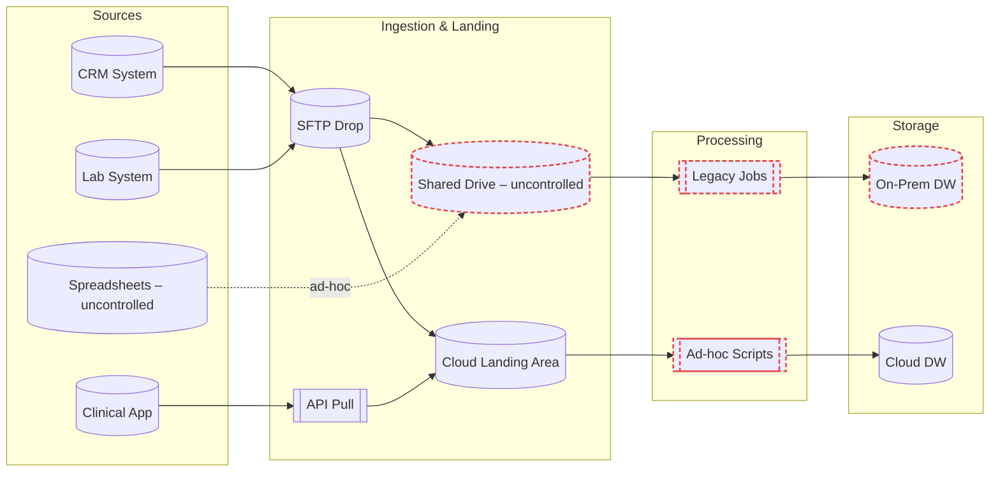
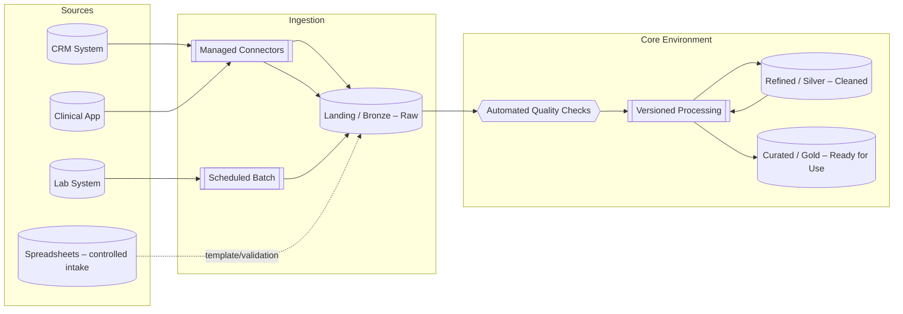
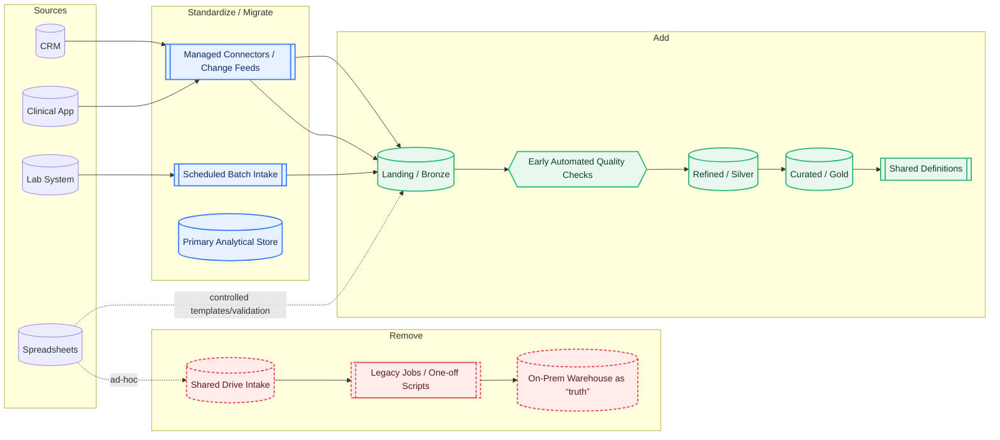

    Many organizations focus on fixing individual data issues but overlook the bigger picture: how data enters, moves, and is governed across the entire environment. This article shows a practical before-and-after example of moving from fragmented data flows to governed, versioned pipelines — an approach that supports scalability, trust, and repeatability without relying on tool-first thinking.

Image created by the author

In my previous article, [Data Platform Engineering for Regulated Teams](/data%20&%20platform%20engineering/data-platform-engineering-for-regulated-data-teams/), I outlined why modernizing data in regulated industries requires more than just swapping out tools.

This follow-up shows what that shift can look like in practice — moving from fragmented, ad-hoc flows to a governed, repeatable data pipelines.<!--more-->

---

## The core idea

Many organizations have data flowing in from multiple systems and vendors, each using their own methods to send it over. Without consistent entry points, quality checks, or structure, the result is hard to scale, hard to trust, and expensive to maintain.

A modern engineering approach changes that by:
- Defining **one “front door”** for all incoming data.
- Running **quality checks early**.
- Using **layered storage** to clearly separate raw, refined, and curated data.
- Governing **how definitions and rules are applied** so they’re consistent everywhere.

---

## Example: Current vs. Future State

Here’s a fictional example to make it concrete.

---

### Current state: fragmented and inconsistent

**Key characteristics**:
- Multiple uncontrolled entry points (SFTP, shared drives, ad-hoc files).
- Different storage environments holding overlapping data.
- Custom logic scattered across scripts that aren’t centrally managed.

---

### Future state: governed and repeatable

**Key characteristics**:
- One governed front door for all sources.
- Automated checks ensure issues are caught before they spread.
- Layered structure (Raw → Refined → Curated) for clarity and trust.
- Repeatable processing patterns replace scattered, one-off scripts.

---

### What Changed: A Delta View
- Red (dashed) = remove/retire
- Green = add
- Blue = standardize or migrate into the governed flow

> *Delta Map highlighting the removal of shared-drive intake, legacy jobs, and on-prem as the primary source of truth. It also shows the addition of Bronze/Silver/Gold layers, early automated quality checks, and shared definitions, along with the standardization of data entry through managed connectors, scheduled batch intake, and a single analytical store.*.

---

## Why this matters

This isn’t about chasing the latest software. It’s about setting up an engineering approach that:

- Handles growth without adding chaos.  
- Makes processes repeatable across teams and projects.  
- Gives you a single, trusted foundation for all downstream work.  

When your data environment is designed this way, technology choices become easier, because they’re guided by a clear operating model instead of being the starting point.

---

## Next steps

If your current-state looks more like the first diagram than the second, the first move isn’t to buy new software. It’s to map your flows, identify the uncontrolled entry points, and decide what your “front door” should be.

From there, governance, automation, and layered structure follow naturally — and the result is an environment that supports the work you’re doing today and the scale you’ll need tomorrow.