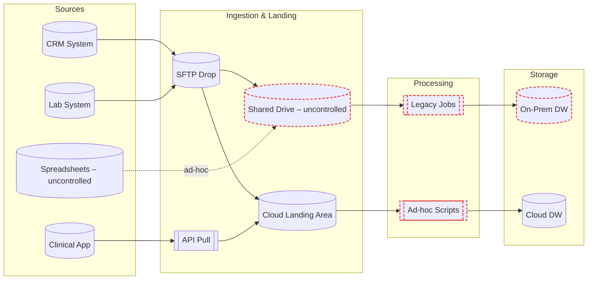
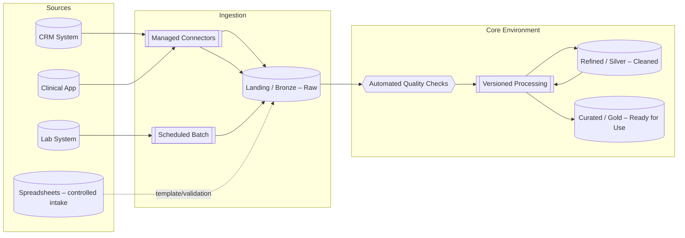
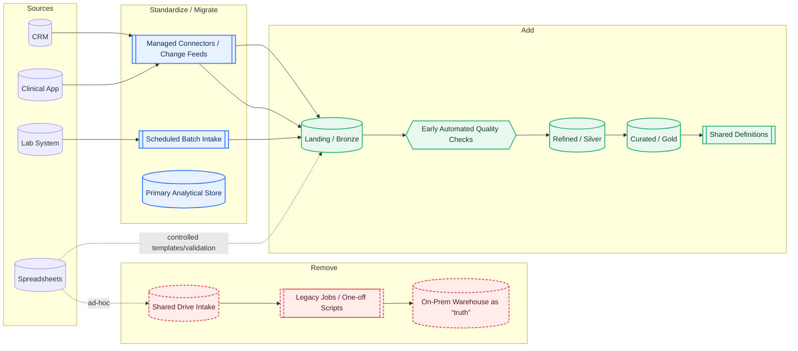
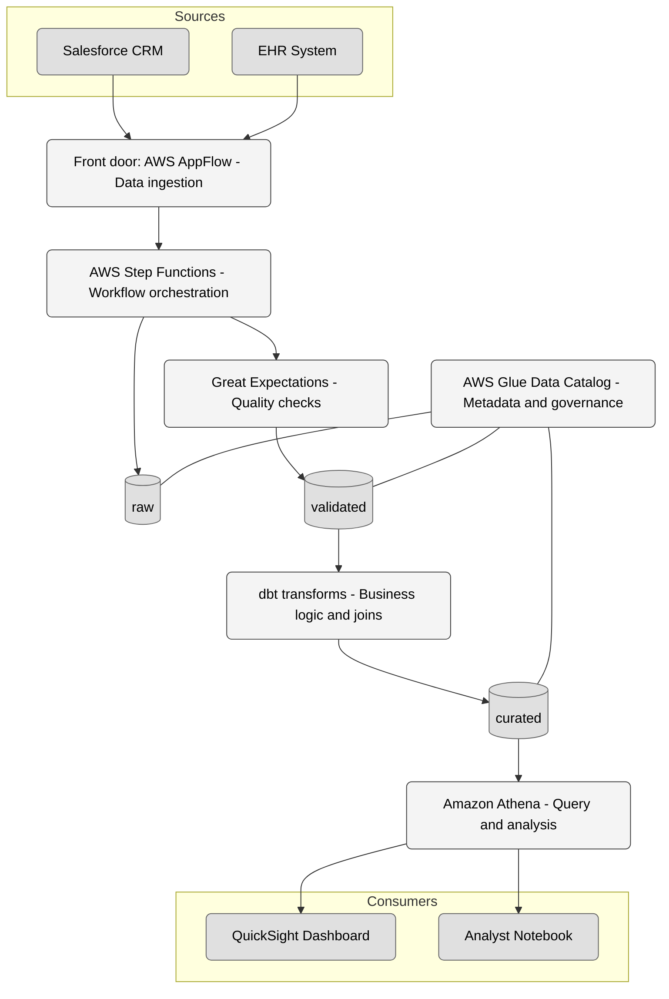

    Many organizations focus on fixing individual data issues but overlook the bigger picture: how data enters, moves, and is governed across the entire environment. This article shows a practical before-and-after example of moving from fragmented data flows to governed, versioned pipeline — an approach that supports scalability, trust, and repeatability without relying on tool-first thinking.

Image created by the author

In my previous article, [Data Platform Engineering for Regulated Teams](/data%20&%20platform%20engineering/data-platform-engineering-for-regulated-data-teams/), I outlined why modernizing data in regulated industries requires more than just swapping out tools.

This follow-up shows what that shift can look like in practice — moving from fragmented, ad-hoc flows to a governed, repeatable data pipelines.

 If you’re unsure what a “data pipeline” is, see my definition here: [What is Data Engineering?](https://mlogan914.github.io/data%20&%20platform%20engineering/what-is-data-platform-engineering/#data-engineering)

 > **Note:** If you are unfamiliar with any terms or acronyms in this article or its diagrams, refer to the [summary of acronyms](#summary-of-acronyms) at the end of the article.
*.
---

## The core idea

Many organizations have data flowing in from multiple systems and vendors, each using their own methods to send it over. Without consistent entry points, quality checks, or structure, the result is hard to scale, hard to trust, and expensive to maintain.

A modern engineering approach changes that by:
- Defining **one “front door”** for all incoming data.
- Running **quality checks early**.
- Using **layered storage** to clearly separate raw, refined, and curated data.
- Governing **how definitions and rules are applied** so they’re consistent everywhere.

---

## Example: Current vs. Future State

Here’s a fictional example to make it concrete.

---

### Current state: fragmented and inconsistent

**Key characteristics**:
- Multiple uncontrolled entry points (SFTP, shared drives, ad-hoc files).
- Different storage environments holding overlapping data.
- Custom logic scattered across scripts that aren’t centrally managed.

---

### Future state: governed and repeatable

**Key characteristics**:
- One governed front door for all sources.
- Automated checks ensure issues are caught before they spread.
- Layered structure (Raw → Refined → Curated) for clarity and trust.
- Repeatable processing patterns replace scattered, one-off scripts.

---

### What Changed: A Delta View
- Red (dashed) = remove/retire
- Green = add
- Blue = standardize or migrate into the governed flow

> *Delta Map highlighting the removal of shared-drive intake, legacy jobs, and on-prem as the primary source of truth. It also shows the addition of Bronze/Silver/Gold layers, early automated quality checks, and shared definitions, along with the standardization of data entry through managed connectors, scheduled batch intake, and a single analytical store.*.

---

## From–To: What Changed and Why

The table below explains each major change from the current state to the governed, repeatable pipelines in the future state. It includes plain-language descriptions and examples so the improvements are easier to understand.

| **Current State** (Removed/Changed) | **Future State** (Added/Standardized) | **Future State Examples** | **What it is** | **Why it’s better** |
|---|---|---|---|---|
| SFTP drops from vendors | Managed connectors / change feeds | Salesforce connector, HL7 feed, Snowflake Data Share | Direct, governed integrations that pull or stream data automatically from source systems | Reduces manual steps, ensures timeliness, and eliminates missed/duplicated files |
| API pulls (custom scripts) | Managed connectors | FHIR API, REST API connector | Built-in, monitored connections to source APIs | No need for fragile, one-off scripts; easier to maintain and scale |
| Shared drive intake (NAS) | Controlled intake (templates, validation) | Secure upload portal, governed S3 bucket | Standard process for uploading data with built-in checks | Prevents uncontrolled or incomplete data from entering the environment |
| Legacy jobs | Versioned processing | dbt, SQL scripts in Git | Processing logic stored in code with version control | Increases reproducibility, auditability, and collaboration |
| Ad-hoc scripts | Standardized transforms | dbt models, reusable SQL macros | Reusable, documented transformation logic | Reduces risk of inconsistencies between teams |
| On-prem DW as “truth” | Single analytical store | Snowflake, Databricks, Redshift | One authoritative store for curated data | Avoids “two sources of truth” and speeds decision-making |
| No early quality checks | Automated quality checks (DQ) | Great Expectations, dbt tests | Rules and tests applied when data first enters | Catches errors early before they spread |
| No layered storage | Bronze / Silver / Gold layers | Bronze (raw files), Silver (cleaned tables), Gold (business-ready views) | Raw (Bronze), refined (Silver), curated (Gold) stages | Clear separation of data states; improves lineage and trust |

---

## One Possible Modern Implementation

The approach above works regardless of technology stack — the architecture matters more than the tools.
That said, here’s one way you could picture it using modern, cloud-native options:

| Architectural Principle       | Example Tools (One of Many Possibilities)                                                                |
| ----------------------------- | -------------------------------------------------------------------------------------------------------- |
| **One “front door” for data** | Managed connectors in *Fivetran*, *Airbyte*, or *AWS AppFlow*                                            |
| **Early quality checks**      | *Great Expectations* or *dbt tests* triggered in orchestration workflows                                 |
| **Layered storage**           | *Delta Lake* (Databricks) or *Apache Iceberg* on *AWS S3*, with *raw*, *validated*, and *curated* zones  |
| **Consistent governance**     | *Unity Catalog*, *AWS Glue Data Catalog*, or *Apache Atlas* for metadata, lineage, and access controls   |
| **Orchestration**             | *Apache Airflow*, *Dagster*, or *AWS Step Functions* to coordinate ingestion, validation, and publishing |

> **Note**: This is just one possible combination.
> The same architecture could be implemented with many other tools — in the cloud, on-premises, or hybrid environments.

---

## Why this matters

This isn’t about chasing the latest software. It’s about setting up an engineering approach that:

- Handles growth without adding chaos.  
- Makes processes repeatable across teams and projects.  
- Gives you a single, trusted foundation for all downstream work.  

When your data environment is designed this way, technology choices become easier, because they’re guided by a clear operating model instead of being the starting point.

---

## Next steps

If your current-state looks more like the first diagram than the second, the first move isn’t to buy new software. It’s to map your flows, identify the uncontrolled entry points, and decide what your “front door” should be.

From there, governance, automation, and layered structure follow naturally — and the result is an environment that supports the work you’re doing today and the scale you’ll need tomorrow.

---

## Summary of Acronyms

| Acronym | Meaning | Description / Context | Example(s) |
|---------|---------|-----------------------|-------------|
| API     | Application Programming Interface | A defined way for software systems to communicate and exchange data. Used for automated data pulls from source systems. | FHIR API, REST API |
| Batch   | Batch Ingestion / Scheduled Batch | A method of loading data at set intervals instead of in real time. | Nightly file load, scheduled ETL job |
| Bronze  | Bronze Layer | The “raw” stage in a layered data environment where data lands before any transformations. | Raw files from source systems |
| CDC     | Change Data Capture | A method of identifying and capturing only the changes (new, updated, deleted records) from a source system. Often used with managed connectors. | Salesforce CDC feed |
| Cloud DW | Cloud Data Warehouse | A centralized analytical database hosted in the cloud. | Snowflake, Redshift, BigQuery |
| CRM     | Customer Relationship Management | A system for managing customer or stakeholder information and interactions. | Salesforce CRM |
| DQ      | Data Quality | Checks and rules applied to ensure incoming data is valid, complete, and consistent. | Great Expectations, dbt tests |
| DW      | Data Warehouse | A centralized analytical database. In “On-Prem DW,” it is hosted in the organization’s own infrastructure. | Oracle DW, Teradata |
| EHR     | Electronic Health Record | A system that stores and manages patient health information. | Epic, Cerner |
| FHIR    | Fast Healthcare Interoperability Resources | A modern standard for exchanging healthcare data via APIs. | FHIR API for patient data |
| Git     | Git Version Control | A system for tracking changes to code and collaborating on development. | GitHub, GitLab |
| Gold    | Gold Layer | The “curated” stage in a layered data environment, ready for use in analytics or reporting. | Business-ready tables/views |
| HL7     | Health Level Seven | A set of international standards for exchanging healthcare data between systems. | HL7 lab results feed |
| LIMS    | Laboratory Information Management System | Software for managing lab samples, test results, and workflows. | LabWare, STARLIMS |
| NAS     | Network Attached Storage | A shared network drive where files are stored and accessed by multiple users. | Internal file share |
| OnDW    | On-Premises Data Warehouse | A data warehouse hosted on servers within the organization’s facilities. | On-prem Oracle DW |
| REST    | Representational State Transfer | A common web API design style for exchanging data over HTTP. | REST API for sales data |
| S3      | Amazon Simple Storage Service | A cloud-based object storage service. | S3 bucket for file uploads |
| SFTP    | Secure File Transfer Protocol | A secure method of transferring files between systems. | SFTP drop folder from vendor |
| Silver  | Silver Layer | The “refined” stage in a layered data environment, where data is cleaned and standardized. | Cleaned tables with standardized fields |

