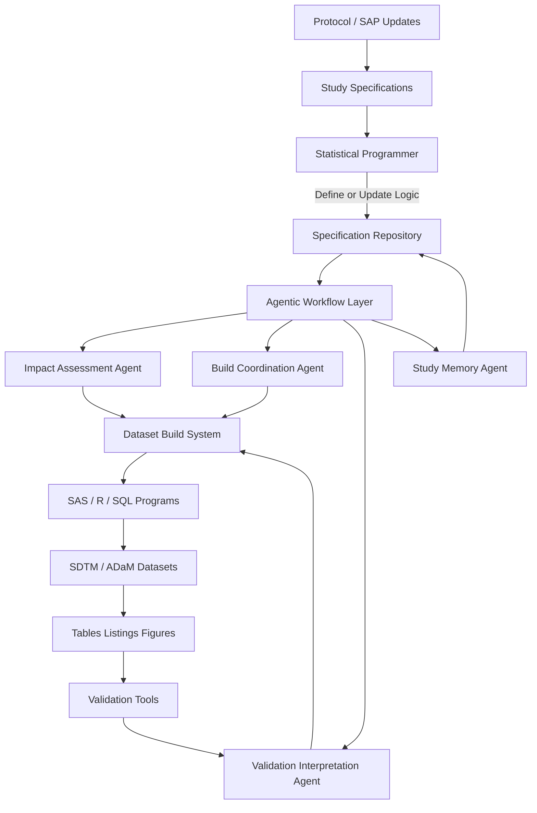

<div class="notice--info">
This article introduces agentic workflows in statistical programming and explores how workflow-aware systems could coordinate study execution, iteration, and validation while preserving existing tools.
</div>

---


<p align="center">Image created by the author</p>


## Managing Study Execution in Modern Statistical Programming

Statistical programming requires continuous impact assessment. A single change to an endpoint, derivation, or data extract can affect multiple datasets and downstream analyses. Before implementing updates, programmers must determine scope, identify dependencies, and confirm which outputs remain current.

That coordination consumes significant effort throughout a study. Programmers interpret specifications, review programs, track dataset relationships, and revisit earlier decisions to maintain consistency across evolving analyses. Much of this work centers on maintaining awareness of study state rather than writing new logic.

Maintaining that awareness through documentation and individual experience becomes increasingly difficult as studies grow in complexity. Teams introduce shared tooling and automation, yet programmers still carry responsibility for understanding how work connects across the study.

This raises an important question:

**What would change if the workflow itself maintained awareness of study execution?**

This article presents a practical exploration of how agentic workflows could operate within statistical programming environments, based on current workflows and emerging system capabilities.

First, let's review some basics:

## What Is a Workflow?

A workflow describes a sequence of steps required to complete a task or reach an outcome.

Statistical programming already relies on workflows. Teams build datasets, run validation checks, generate outputs, and repeat these steps as studies evolve. Traditional workflows execute when someone explicitly starts the next step. A programmer reviews results, determines impact, and decides what should happen next.

## What Is an Agent?

An agent is a system component that observes what is happening within an environment and helps determine what action should follow.

An agent does not replace human decision making. Instead, it maintains awareness of system state and assists by identifying changes, surfacing impacts, or coordinating next steps that would otherwise require manual investigation.

> 💡 A true *AI agent* can dynamically select actions to achieve a goal, while an *agentic workflow* constrains how goals are pursued within a predefined operational structure.

## What Is an Agentic Workflow?

An agentic workflow combines structured execution with systems that actively monitor progress and help move work forward.

Rather than executing a task and stopping, the workflow evaluates outcomes and participates in determining what should happen next. When conditions change, the system identifies affected components, coordinates required actions, and supports repeated execution until study objectives are satisfied or human review becomes necessary.

Within statistical programming, a workflow might:

- Identify downstream datasets affected by a modification  
- Recognize when regenerated outputs invalidate prior results  
- Organize validation findings by likely operational cause  
- Preserve reasoning associated with derivation updates  
- Highlight execution steps required after a change  

The statistical programmer continues to define analytical intent and implement logic. The workflow maintains awareness across the study and supports progression as work evolves.

> 💡 I think of an *agentic workflow* as "orchestration with reasoning", building on the coordination model described in [Data Orchestration: The Conductor Behind the Pipelines](https://mlogan914.github.io/orchestration-the-conductor-behind-the-pipelines/).

## Iteration in Practice

Statistical programming already depends on iterative execution. Teams rebuild datasets, review validation findings, adjust derivations, and rerun analyses until outputs meet study requirements.

Today, programmers manage this loop manually.

Example today:

Programmer rebuilds ADAE

1. Validation fails  
2. Programmer investigates  
3. Programmer updates logic  
4. Programmer reruns  
5. Programmer checks again  

> Humans manage the iteration.

An agentic workflow participates directly in this cycle.

Goal:
Produce a validated ADAE dataset aligned with the current SAP.

**Agentic iteration cycle:**

1. Detect AE derivation update  
2. Rebuild ADAE  
3. Run validation automatically  
4. Analyze validation output  
5. Evaluate validation outcomes  
6. Propose follow-up actions or request clarification if needed  
7. Re-run affected steps  
8. Continue until validation criteria pass or human review is required  

> The workflow no longer stops after execution. It iterates toward a defined study state.

## Architecture of an Agentic Statistical Programming Workflow

Agentic workflows do not replace existing statistical programming systems. Instead, they introduce coordination around assets that already exist.

The following model illustrates how such a workflow could operate in practice.



## What the Statistical Programmer Actually Does

In this model, the statistical programmer remains central to study execution.

Programmers continue to:

- Interpret protocol and SAP intent  
- Define derivations  
- Update specifications  
- Review proposed impacts  
- Approve execution steps  
- Investigate unexpected data behavior  

Instead of manually determining every downstream consequence, programmers define intent through specifications or logic updates while the workflow tracks what must occur next.


## What Happens to Existing SAS Code?

Existing SAS programs remain part of execution.

Organizations do not need to rewrite validated codebases to introduce agentic workflows. SAS, R, or SQL programs continue to generate SDTM datasets, ADaM datasets, and analysis outputs exactly as they do today.

The system tracks:

- Which programs depend on others  
- When outputs become outdated  
- Which datasets require rebuilding  
- How execution relates to specifications  

SAS programs function as execution engines inside a coordinated workflow.

## Example: Updating an AE Derivation

Consider a realistic study scenario.

A safety team updates treatment-emergent adverse event logic following clarification in the SAP.

### Today

A programmer typically:

1. Reviews SAP updates  
2. Locates affected programs  
3. Determines ADAE dependency manually  
4. Reruns datasets  
5. Discovers downstream impacts through validation or output review  
6. Documents reasoning afterward  

Each step requires reconstruction of study context.

### Under an Agentic Workflow

The programmer updates the derivation specification or logic definition.

The workflow immediately evaluates study context and produces:

```
Change detected: AE derivation updated

Impacted:
SDTM.AE
ADAE
Safety Tables

Required actions:
Rebuild ADAE
Refresh Safety Outputs
Run validation checks
```

The programmer reviews and approves execution.

The workflow coordinates rebuild order, records execution history, and links results back to the originating specification change.

Validation results return grouped by operational cause rather than individual rule failures.

Study memory records the reason for the update automatically.

Programming logic remains human authored, but coordination becomes system supported.

## Files and Artifacts in the Workflow

An agentic workflow connects artifacts that statistical programmers already manage.

### Programmer Inputs

- SAP updates  
- Mapping specifications  
- Metadata definitions  
- Derivation rules  
- Dataset standards  

### Workflow Managed Artifacts

- Specification repositories  
- Dataset lineage maps  
- Execution history  
- Validation outputs  
- Implementation decisions  

## How Daily Work Begins to Change

Agentic workflows influence interaction with study execution rather than analytical responsibility.

Programmers spend less time tracing dependencies or coordinating reruns. Daily work shifts toward evaluating impacts, refining derivations, investigating inconsistencies, and confirming analytical outcomes.

Workflow awareness persists continuously, reducing interruptions caused by rediscovering study state.


## Implications for the Role

Agentic workflows do not reduce the need for statistical programming expertise. Clinical studies still require interpretation, judgment, and accountable decision making.

However, programmers increasingly supervise coordinated study execution rather than manually managing workflow state. The role expands to include oversight of how datasets, analyses, and validation activities move through the study lifecycle.

## A Practical Path Forward

Organizations will likely adopt agentic workflows incrementally. Early implementations may focus on impact assessment, dependency tracking, and validation interpretation because these capabilities improve efficiency without altering validated analytical processes.

As workflow awareness improves, teams gain clearer visibility into study execution and reduce operational coordination effort.

## Closing Thoughts

Statistical programming already operates as a structured production workflow that evolves continuously throughout a clinical study. Agentic workflows describe a potential evolution of this environment, where systems maintain operational context and support coordination activities across study execution.

This article presents a theoretical model of how such workflows could operate if these capabilities prove implementable in regulated environments. It remains an open question how workflow awareness and automation can be introduced safely, and the practical limits of these systems are still being actively evaluated.

Early adoption would likely begin with incremental improvements such as faster impact assessment, clearer execution flow, and improved continuity across study phases. Over time, these changes could reshape how statistical programming work executes.

Statistical programming provides a strong environment for exploring practical models of agentic workflows grounded in real operational needs.

---

> **Disclaimer:** This article reflects my personal views only and is for informational purposes. It does not represent professional advice or the positions of any past or current employer. No confidential or proprietary information is shared, and I disclaim all liability for how you use its content. Third-party links or tool mentions are not endorsements.